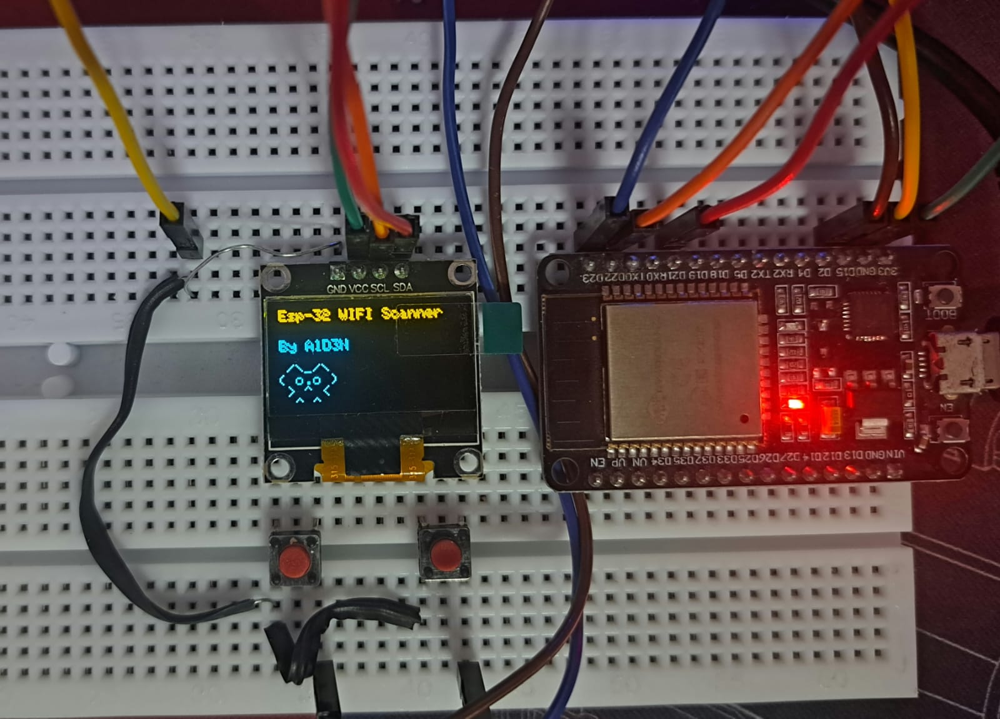
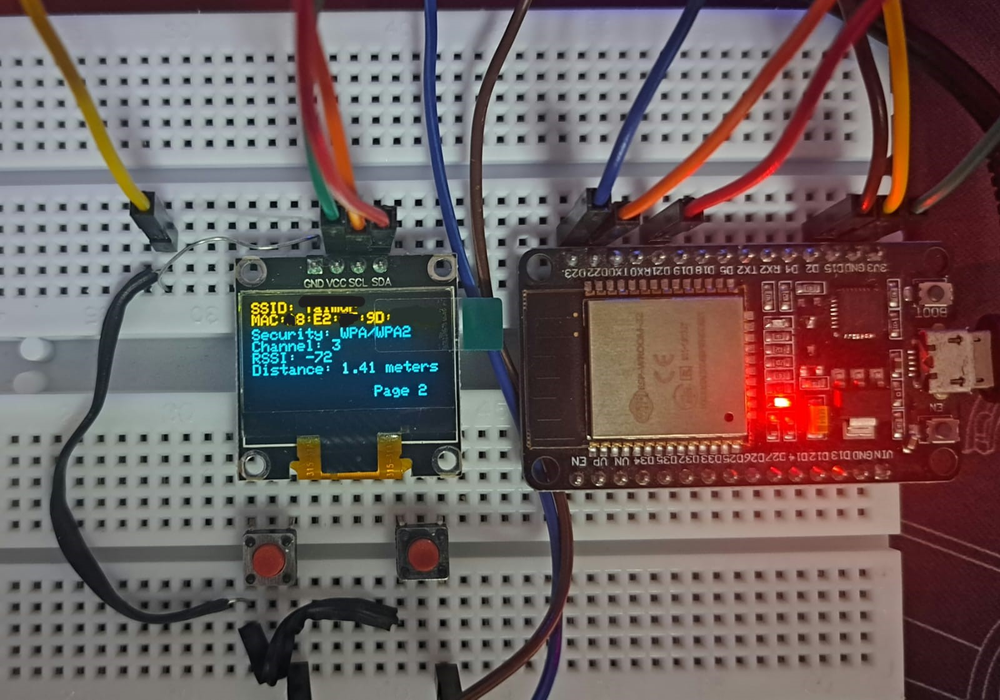
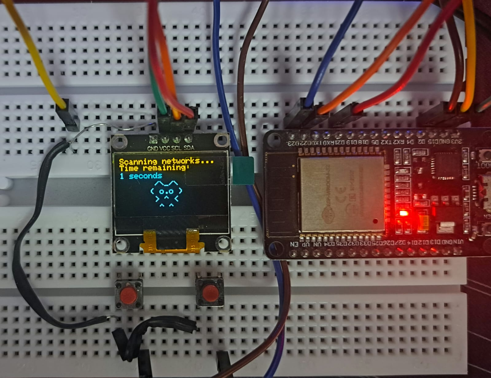
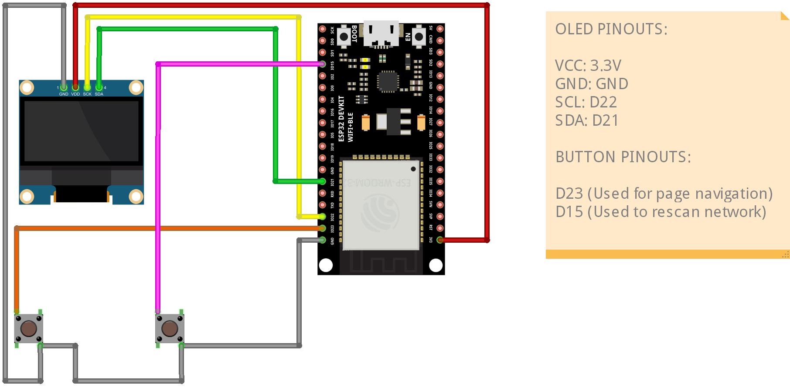
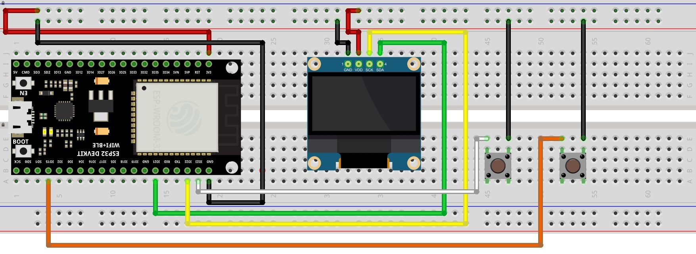
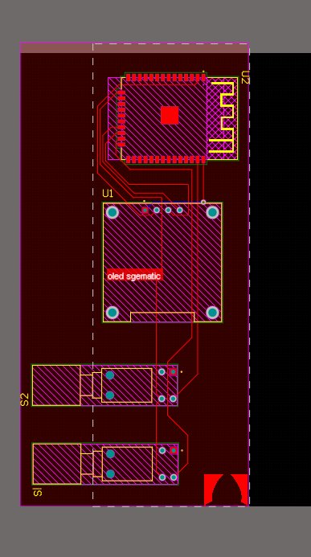
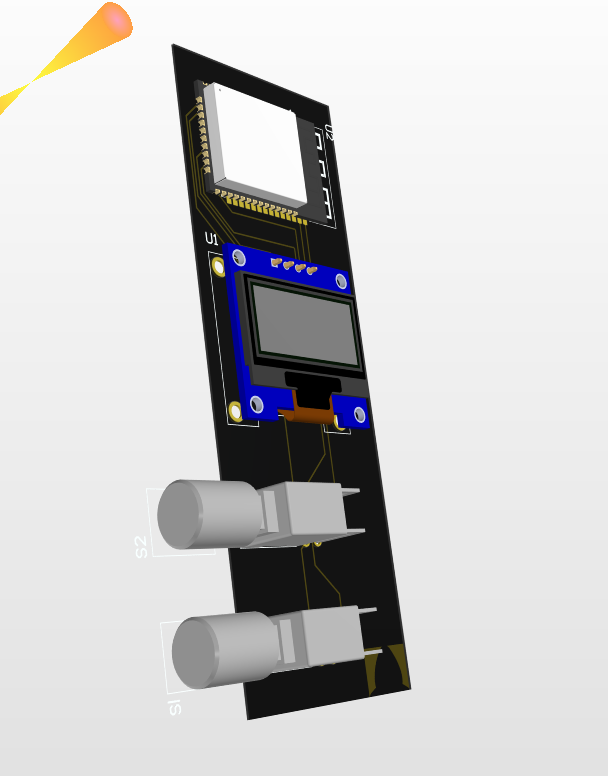
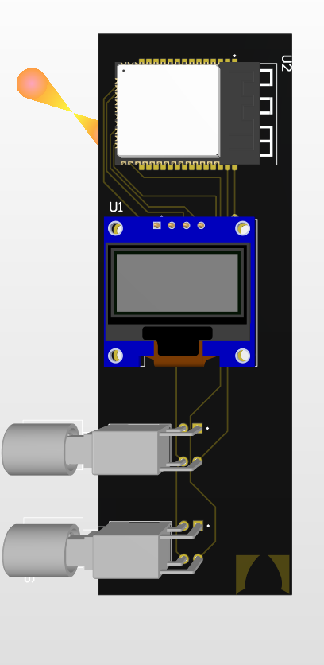
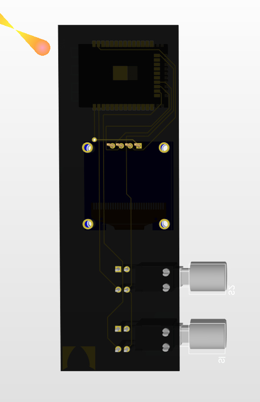

ESP-32 Wi-Fi Scanner
=====================

📔 Table of Contents:
-------------
About the Project

Pictures

Features

Getting Started

Schematic

Installation

Usage

Contact

-------------
-------------

🔎 About the Project
-------------
This project implements a Wi-Fi scanner using an ESP32 microcontroller. It allows users to scan for nearby Wi-Fi networks, display information such as SSID, MAC address, security type, RSSI, distance, and channel on an OLED display. Additionally, it features a functionality for rescanning networks at regular intervals. 

📷 Pictures
-------------

📝 Features
-------------
* Estimates distance in metres between AP and ESP 32 with the help of RSSI value.
* Displays each Wi-Fi info on a separate page.
* Page can be changed with the help of a button.
* Displays a page number on the bottom right and number updates with each page ,it resets when it returns to first Wi-Fi info.
* Has a functionality to rescan and locate any changes in the Wi-Fi networks nearby.

🧰 Getting Started
-------------
I used an ESP32 for the microcontroller and an OLED screen to display the Wi-Fi networks. Push buttons were also used to navigate across the different Wi-Fi access points scanned.

Parts Needed:
-------------

* ESP32

* SSD1306 OLED Display

* Push Button

🔌 Schematics
-------------
The table indicating the connections and the schematics for assembly are shown below.

ESP32 Pinout 
-------------

## **OLED Display:**

* VCC: 3.3V

* GND: GND

* SCL: D22

* SDA: D21

Button:
-------
* D23

* D15

Complete Schematic:
-------------

Breadboard Schematic:
-------------

⚡ PCB (Not tested):
-------------
I made a prototype of a PCB for this circuit will be sharing the files once i verify it has no problems.

Images are given below:

Will upload the schematic files soon...

-------------
-------------

⚙️ Flashing Code:
-------------
To flash this code the Arduino IDE software will be needed which can be downloaded from the official arduino website at : https://www.arduino.cc/en/software.

Before uploading the code you need to install these libraries on the Arduino IDE:

  • Wire.h:

You don't need to download Wire.h as it's a core library included with the Arduino IDE. It provides functions for I2C communication on compatible boards. 

     • Adafruit_GFX.h:

In Arduino IDE, go to Sketch > Include Library > Manage Libraries.... 
Search for "Adafruit GFX" and install the library by Adafruit Industries. This will also install the necessary dependencies like Adafruit_SSD1306.h. 
     • Adafruit_SSD1306.h:

Installled while installing the Adafruit_GFX.h libraries in previous step.

     • WiFi.h:

WiFi.h is included with the Arduino IDE.

       
    1. Steps to add ESP32 boards in Arduino IDE:

1. Install ESP32 Add-on:
    • Open the Arduino IDE. 
    • Go to File > Preferences. 
    • In the Additional Boards Manager URLs field, copy and paste the following URL: 
https://dl.espressif.com/dl/package_esp32_index.json
    • Click OK. 
2. Install ESP32 Board Package:
    • Go to Tools > Board > Boards Manager.... 
    • Search for "ESP32" in the search bar. 
    • Select the esp32 by Espressif Systems package and click Install. 
3. Verify Installation:
    • After installation, you should see various ESP32 boards listed under Tools > Board. 
    • Select the specific ESP32 board you're using (e.g., ESP32 Dev Module).

After successfully installing all libraries and selecting the correct board in the board manager choose the correct COM port and then upload the code to the ESP32.

This process should successfully take place without any errors.

(In case of any issues or bugs open an issue on github describing what the issue or bug is OR contact me via social media or mail.)

👀 Usage:
-------------

After uploading the code, An intro screen appears with the name and credits (also an ASCII art of a cat),which switches to the Wi-Fi information page where the wifi info of all the wifis are available. Each wifi network has its own page. The button connected to the pin D23 of the ESP32 can be used to navigate the different pages of WIFI networks. To initiate a rescan of the networks the button connected to the pin D15 has to be pressed , a loading screen with a countdown for 5 seconds (along a ASCII art of a cat) will appear. Soon after the timer reaches zero the main wifi information page appears again but with updated WIFI information.

🤝 Contact

CyberTechNex (A1D3N) - 

Email:
A1D3N.SM1TH@proton.me

Instagarm:
https://www.instagram.com/cybertechnex_/

Also check out my blog posts at:
https://cybertechnex.co.in/

                                     
Project Link: https://github.com/CyberTechNex/ESP32-WIFI-Scanner

💎 Acknowledgements:

**Fattcat**
